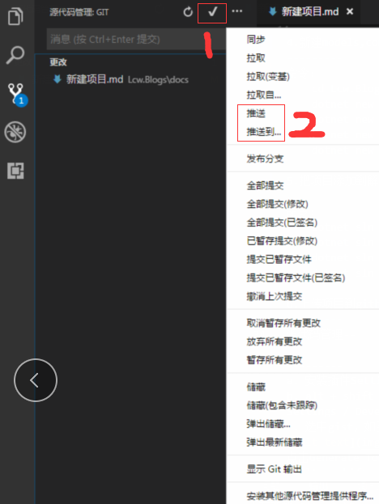

新建项目并同步到github
=========

1.在github上新建Reoisitories,复制地址，
----------
如： https://github.com/lcawen/Lcw.Blogs.git    
2.在文件夹中git clone项目，如下：
---------  
git clone https://github.com/lcawen/Lcw.Blogs.git

3.新建sln解决方案
---------  
命令：dotnet new sln -o Lcw.Blogs  

4.新建models,common,buisness,tests类库,以及mvc项目webapp  
---------  
命令：  
    cd Lcw.Blogs  
    dotnet new classlib -o Models -n Lcw.Blogs.Models  
    dotnet new classlib -o Common -n Lcw.Blogs.Common  
    dotnet new classlib -o Buisness -n Lcw.Blogs.Buisness  
    dotnet new mvc -o WebApp -n Lcw.Blogs.WebApp    
    
5.把项目添加到解决方案中
----------
命令：  
    dotnet sln add Models/Lcw.Blogs.Models     
    dotnet sln add Common/Lcw.Blogs.Common.csproj  
    dotnet sln add Buisness/Lcw.Blogs.Buisness.csproj  
    dotnet sln add WebApp/Lcw.Blogs.WebApp.csproj  

6.上传项目到github中
---------  
源代码管理--提交更改--推送  
如下：  

---------
a. 安装插件Settings Sync重启  
b. alt + shift + u 弹出github的Generate new token窗口，如果未登录先登录,也可通过Settings / Developer settings / Personal access tokens / Generate New Token进入  
c. 选中gist，如图：
  
点击Generate Token,复制生成的token  
d.alt + shift + u,在弹出的文本框中粘贴token，按下enter，如下：

